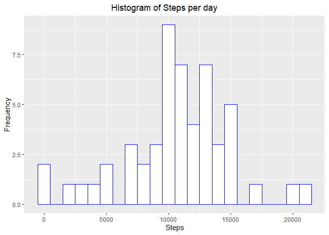
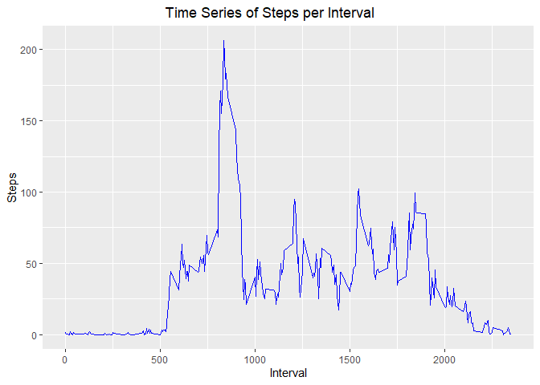
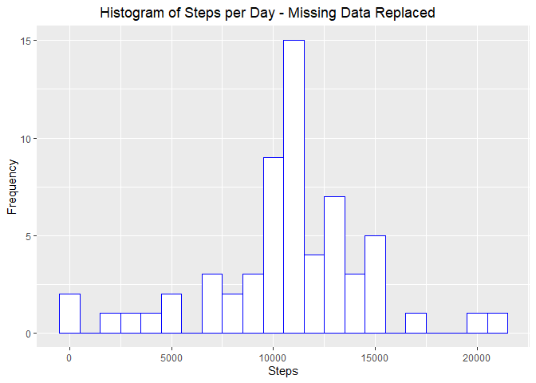
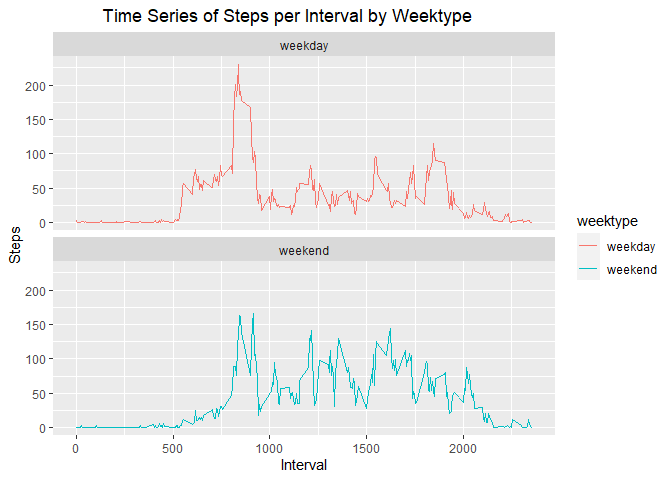

<body style="background-color:LightSkyBlue;">
## Introduction
This assignment makes use of data from a personal activity monitoring device. This device collects data at 5 minute intervals throughout the day. The data consists of two months of data from an anonymous individual collected during the months of October and November, 2012 and include the number of steps taken in 5 minute intervals each day.

This document presents the results from Project Assignment 1 in the Coursera course Reproducible Research, written in a single R markdown document that can be processed by knitr and transformed into an HTML file.

## Environment setup and configuration

```r
## 
## Reproducible Data - Project 1
##
library(dplyr)
```

```
## 
## Attaching package: 'dplyr'
```

```
## The following objects are masked from 'package:stats':
## 
##     filter, lag
```

```
## The following objects are masked from 'package:base':
## 
##     intersect, setdiff, setequal, union
```

```r
library(ggplot2)
library(knitr)
opts_chunk$set(echo = TRUE)
```


## Loading and preprocessing the data
Code that is needed to load and process the activity data.  

**1. Load the data**  

```r
## Read in raw data from activity.csv file
rawdata <- read.csv("activity.csv",header=TRUE,na.strings="NA")
```

**2. Process/transform the data**  

```r
## Transform the data convert date attribute to valid Date - NEW DATASET
data <- rawdata %>% mutate(date=as.Date(date,format = "%Y-%m-%d"))
```


## What is mean total number of steps taken per day?
The mean total number of steps taken per day, ignoring any missing data in the dataset.  

**1. Calculate the total number of steps taken per day**  

```r
## Data filtered and grouped by date for a summary of steps per day
dailysteps <- data %>%
    filter(!is.na(steps)) %>%
    group_by(date) %>%
    summarize(steps = sum(steps)) %>%
    print(dailysteps)
```

```
## `summarise()` ungrouping output (override with `.groups` argument)
```

```
## # A tibble: 53 x 2
##    date       steps
##    <date>     <int>
##  1 2012-10-02   126
##  2 2012-10-03 11352
##  3 2012-10-04 12116
##  4 2012-10-05 13294
##  5 2012-10-06 15420
##  6 2012-10-07 11015
##  7 2012-10-09 12811
##  8 2012-10-10  9900
##  9 2012-10-11 10304
## 10 2012-10-12 17382
## # ... with 43 more rows
```

**2. Histogram of the total number of steps taken each day**  

```r
# Basic histogram of summarized steps by day
ggplot(dailysteps, aes(x=steps)) + 
    geom_histogram(binwidth=1000, color="blue", fill="white") +
    labs(title = "Histogram of Steps per day", x = "Steps", y = "Frequency") +
    theme(plot.title.position = 'plot',plot.title = element_text(hjust = 0.5))
```

<!-- -->

**3. The the mean and median total number of steps taken per day**  
<p style="color:red;"><b>NOTE:  ignore the missing values in the dataset</b></p> 

```r
## Calculation of mean steps taken each day.
meansteps <- mean(dailysteps$steps, na.rm=TRUE)
    print(meansteps)
```

```
## [1] 10766.19
```

```r
## Calculation of median steps taken each day.
medsteps <- median(dailysteps$steps, na.rm=TRUE)
    print(medsteps)
```

```
## [1] 10765
```


## What is the average daily activity pattern?
Summary of the average daily activity pattern.  

**1. Time series plot of the 5-minute interval (x-axis) and the average number of steps taken, averaged across all days (y-axis)**  

```r
## Data filtered and grouped by interval for mean of steps per day
intvlsteps <- data %>%
    filter(!is.na(steps)) %>%
    group_by(interval) %>%
    summarize(steps = mean(steps))
```

```
## `summarise()` ungrouping output (override with `.groups` argument)
```

```r
    print(intvlsteps)
```

```
## # A tibble: 288 x 2
##    interval  steps
##       <int>  <dbl>
##  1        0 1.72  
##  2        5 0.340 
##  3       10 0.132 
##  4       15 0.151 
##  5       20 0.0755
##  6       25 2.09  
##  7       30 0.528 
##  8       35 0.868 
##  9       40 0     
## 10       45 1.47  
## # ... with 278 more rows
```

```r
## Basic time series of mean steps per day
ggplot(intvlsteps, aes(x=interval, y=steps)) +
    geom_line(color = "blue") +
    labs(title = "Time Series of Steps per Interval", x = "Interval", y = "Steps") +
    theme(plot.title.position = 'plot',plot.title = element_text(hjust = 0.5))
```

<!-- -->

**2. The 5-minute interval, on average across all the days in the dataset, that contains the maximum number of steps**  

```r
## Data evaluated to determine interval with maximum steps, on average, across all the days
maxintvl <- intvlsteps[which.max(intvlsteps$steps),]
    print(maxintvl)
```

```
## # A tibble: 1 x 2
##   interval steps
##      <int> <dbl>
## 1      835  206.
```


## Inputing missing values
<p style="color:red;"><b>NOTE: There are a number of days/intervals where there are missing values (coded as NA). The presence of missing days may introduce bias into some   calculations or summaries of the data.</b></p>    

**1. Calculate and report the total number of missing values in the dataset (i.e. the total number of rows with NAs)**   

```r
## Summarize total missing values in the dataset
nodata <- sum(is.na(data$steps))
    print(nodata)
```

```
## [1] 2304
```

**2. Devise a strategy for filling in all of the missing values in the dataset. The mean for a specific 5-minute interval used to replace NA values**  

```r
## Data evaluated to calculate the number of steps taken in each 5-minute interval per day
## Transform the data replacing NA steps with the average number of steps in the same 5-min interval
## from the date transformed data, use tapply for filling in the missing values  - NEW DATASET
datafill <- data
nas <- is.na(datafill$steps)
avgintvl <- tapply(datafill$steps, datafill$interval, mean, na.rm=TRUE, simplify=TRUE)
datafill$steps[nas] <- avgintvl[as.character(datafill$interval[nas])]
checkdata <- sum(is.na(datafill$steps))
    print(checkdata)
```

```
## [1] 0
```

**3. A new dataset that is equal to the original dataset but with the missing data replaced**  

```r
## Data evaluated to calculate the number of steps taken in each 5-minute interval per day
stepsfill <- datafill %>%
    filter(!is.na(steps)) %>%
    group_by(date) %>%
    summarize(steps = sum(steps)) %>%
    print(stepsfill) 
```

```
## `summarise()` ungrouping output (override with `.groups` argument)
```

```
## # A tibble: 61 x 2
##    date        steps
##    <date>      <dbl>
##  1 2012-10-01 10766.
##  2 2012-10-02   126 
##  3 2012-10-03 11352 
##  4 2012-10-04 12116 
##  5 2012-10-05 13294 
##  6 2012-10-06 15420 
##  7 2012-10-07 11015 
##  8 2012-10-08 10766.
##  9 2012-10-09 12811 
## 10 2012-10-10  9900 
## # ... with 51 more rows
```

**4. Histogram of the total number of steps taken each day and calculation to report the mean and median total number of steps taken per day**    

```r
## Basic histogram of summarized steps by day with NA values replaced with interval average data
ggplot(stepsfill, aes(x = steps)) +
    geom_histogram(binwidth = 1000, color="blue", fill = "white") +
    labs(title = "Histogram of Steps per Day - Missing Data Replaced", x = "Steps", y = "Frequency") +
    theme(plot.title.position = 'plot',plot.title = element_text(hjust = 0.5))
```

<!-- -->


```r
## Calculation of mean steps taken each day on the NA filled data.
meanstepsfill <- mean(stepsfill$steps, na.rm = TRUE)
    print(meanstepsfill)
```

```
## [1] 10766.19
```


```r
## Calculation of median steps taken each day on the NA filled data.    
medianstepsfill <- median(stepsfill$steps, na.rm = TRUE)
    print(medianstepsfill)
```

```
## [1] 10766.19
```

## Are there differences in activity patterns between weekdays and weekends?
<p style="color:red;"><b>NOTE:  Use the dataset with the filled-in missing values for this part.</b></p>    

**1. Create a new factor variable in the dataset with two levels – “weekday” and “weekend” indicating whether a given date is a weekday or weekend day**   

```r
## Transform the data replacing NA steps with the average number of steps in the same 5-min interval
## from the date transformed data, use tapply for filling in the missing values  - NEW DATASET
datafill <- data
nas <- is.na(datafill$steps)
avgintvl <- tapply(datafill$steps, datafill$interval, mean, na.rm=TRUE, simplify=TRUE)
datafill$steps[nas] <- avgintvl[as.character(datafill$interval[nas])]
## checkdata <- sum(is.na(datafill$steps))
##    print(checkdata)
## Transform the step NA filled data, add factor variable for weekday or weekend - NEW DATASET
datalevels <- mutate(datafill, weektype = ifelse(weekdays(datafill$date) == "Saturday" | weekdays(datafill$date) == "Sunday", "weekend", "weekday"))
    str(datalevels)
```

```
## 'data.frame':	17568 obs. of  4 variables:
##  $ steps   : num  1.717 0.3396 0.1321 0.1509 0.0755 ...
##  $ date    : Date, format: "2012-10-01" "2012-10-01" ...
##  $ interval: int  0 5 10 15 20 25 30 35 40 45 ...
##  $ weektype: chr  "weekday" "weekday" "weekday" "weekday" ...
```

```r
## Data evaluated to calculate the average steps in the 5-minute interval for weekday and weekend
intervallevels <- datalevels %>%
    group_by(interval, weektype) %>%
    summarize(steps = mean(steps))
```

```
## `summarise()` regrouping output by 'interval' (override with `.groups` argument)
```

```r
    print(intervallevels)
```

```
## # A tibble: 576 x 3
## # Groups:   interval [288]
##    interval weektype   steps
##       <int> <chr>      <dbl>
##  1        0 weekday  2.25   
##  2        0 weekend  0.215  
##  3        5 weekday  0.445  
##  4        5 weekend  0.0425 
##  5       10 weekday  0.173  
##  6       10 weekend  0.0165 
##  7       15 weekday  0.198  
##  8       15 weekend  0.0189 
##  9       20 weekday  0.0990 
## 10       20 weekend  0.00943
## # ... with 566 more rows
```

**2. A panel plot containing a time series plot of the 5-minute interval (x-axis) and the average number of steps taken, averaged across all weekdays and weekend days (y-axis)**  

```r
## Basic time series of mean steps per day weekday vs weekend
ggplot(intervallevels, aes(x=interval, y=steps, color = weektype)) +
    geom_line() +
    facet_wrap(~weektype, ncol = 1, nrow=2) +
    labs(title = "Time Series of Steps per Interval by Weektype", x = "Interval", y = "Steps") +
    theme(plot.title.position = 'plot',plot.title = element_text(hjust = 0.33))
```

<!-- -->
